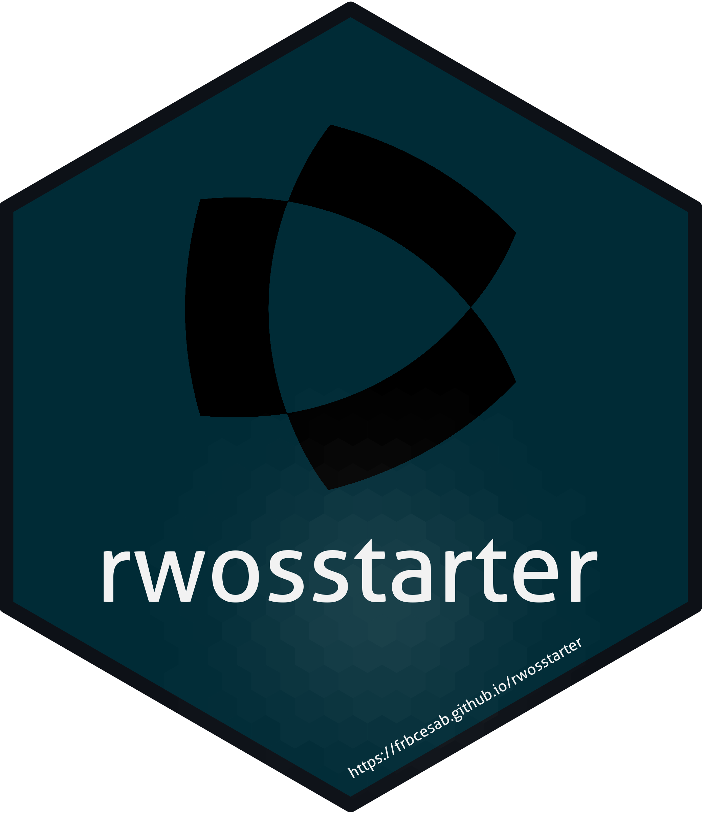

<!-- README.md is generated from README.Rmd. Please edit that file -->


```{r, include = FALSE}
knitr::opts_chunk$set(collapse  = TRUE,
                      comment   = "#>",
                      fig.path  = "man/figures/",
                      out.width = "100%")
```


rwosstarter 
=========================================================

<!-- badges: start -->
<!-- badges: end -->


The goal of the R package `rwosstarter` is to **{{ PLEASE ADD A FEW LINES }}**


## Installation

You can install the development version from [GitHub](https://github.com/) with:

```{r eval = FALSE}
# install.packages("remotes")
remotes::install_github("frbcesab/rwosstarter")
```

Then you can attach the package `rwosstarter`:

```{r eval = FALSE}
library("rwosstarter")
```


## Overview

Here is an overview of `rwosstarter` content: **{{ PLEASE ADD A FEW LINES }}**


## Citation

Please cite this package as: 

> Casajus Nicolas (`r format(Sys.Date(), "%Y")`) rwosstarter: An R 
package to **{{ TITLE }}**. R package version 0.0.0.9000.


## Code of Conduct

Please note that the `rwosstarter` project is released with a 
[Contributor Code of Conduct](https://www.contributor-covenant.org/version/2/1/code_of_conduct/). 
By contributing to this project, you agree to abide by its terms.
