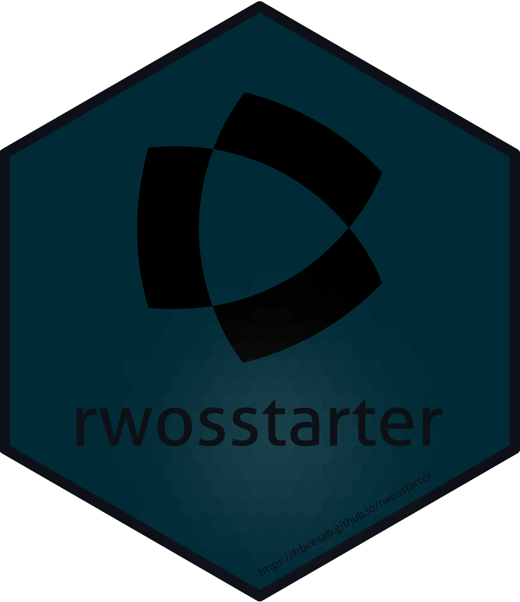

<!-- README.md is generated from README.Rmd. Please edit that file -->

# rwosstarter 

<!-- badges: start -->

[](https://github.com/frbcesab/rwosstarter/actions/workflows/R-CMD-check.yaml)
[](https://github.com/frbcesab/rwosstarter/actions/workflows/pkgdown.yaml)
[](https://choosealicense.com/licenses/gpl-2.0/)
<!-- badges: end -->

## Table of contents

<p align="left">
• <a href="#overview">Overview</a><br> •
<a href="#requirements">Requirements</a><br> •
<a href="#installation">Installation</a><br> •
<a href="#get-started">Get started</a><br> •
<a href="#citation">Citation</a><br> •
<a href="#contributing">Contributing</a><br> •
<a href="#acknowledgments">Acknowledgments</a>
</p>

## Overview

The R package `rwosstarter` is a client to the [Web of Science Starter
API](https://developer.clarivate.com/apis/wos-starter). It is dedicated
to retrieve metadata (including times-cited counts) of scientific
publications matching search terms. It can be used to run a literature
synthesis.

`rwosstarter` is freely released by the
[FRB-CESAB](https://www.fondationbiodiversite.fr/en/about-the-foundation/le-cesab/).

## Requirements

The [Web of Science Starter
API](https://developer.clarivate.com/apis/wos-starter) uses an API Key
access. To obtain your own API key, please visit the [Clarivate
Developer Portal](https://developer.clarivate.com/) and follow
instructions.

Once your access has been granted by Clarivate, you have to store your
API key on your computer. A good practice in [managing
secrets](https://cran.r-project.org/web/packages/httr/vignettes/secrets.html)
is to store this API key as an R Environment variable.

Use the function `usethis::edit_r_environ()` to open the `~/.Renviron`
file and add this line (replace ‘z999zzz…’ by your actual API key):

    WOS_STARTER_KEY='z999zzz9zzz999999z9z99zz999zz999'

Save this file and restart R.

## Installation

You can install the development version from
[GitHub](https://github.com/) with:

``` r
# install.packages("remotes")
remotes::install_github("frbcesab/rwosstarter")
```

## Get started

The general workflow is the following:

- Use the function `rwosstarter::wos_search()` to get the total number
  of references that match the Web of Science query.
- Use the function `rwosstarter::wos_get_records()` to download
  reference data.

## Citation

Please cite this package as:

> Casajus N (2023) rwosstarter: An R Client to the Web of Science
> Starter API. R package version 0.1.
> <https://github.com/FRBCesab/rwosstarter>

## Contributing

All types of contributions are encouraged and valued. For more
information, check out our [Contributor
Guidelines](https://github.com/FRBCesab/rwosstarter/blob/main/CONTRIBUTING.md).

Please note that the `rwosstarter` project is released with a
[Contributor Code of
Conduct](https://contributor-covenant.org/version/2/1/CODE_OF_CONDUCT.html).
By contributing to this project, you agree to abide by its terms.

## Acknowledgments

The author of this project would like to thank Clarivate for giving
access to the Starter API.
